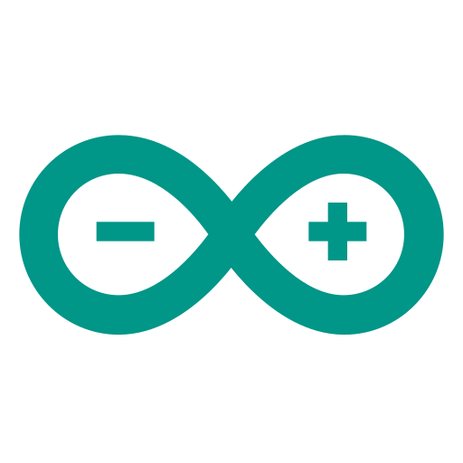

  
  <h1>Status Led ESP32</h1>
  
  

    An ESP32 based project to create a status led to be placed on top of your monitor.
  

  
<h4>
    <a href="https://github.com/Ki-re/Status_Led_ESP32/issues/">Report Bug</a>
   · 
    <a href="https://github.com/Ki-re/Status_Led_ESP32/issues/">Request Feature</a>
   · 
    <a href="https://github.com/Ki-re/Status_Led_ESP32/pulls">Contribute</a>
  </h4>

 

<!-- About the Project -->

## About the Project

TO-DO

<!-- Requirements -->

## Requirements

TO-DO

<!-- Get Started -->

## Get Started

TO-DO

<!-- License -->

## License

Distributed under the no License. See LICENSE.txt for more information.